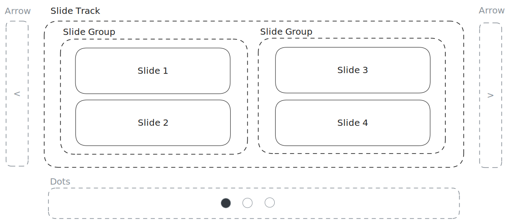
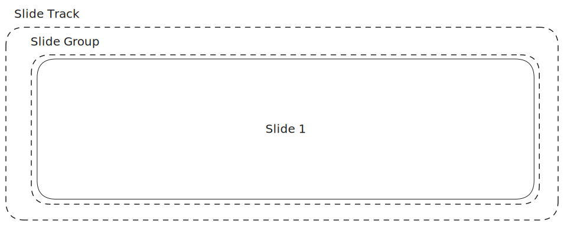
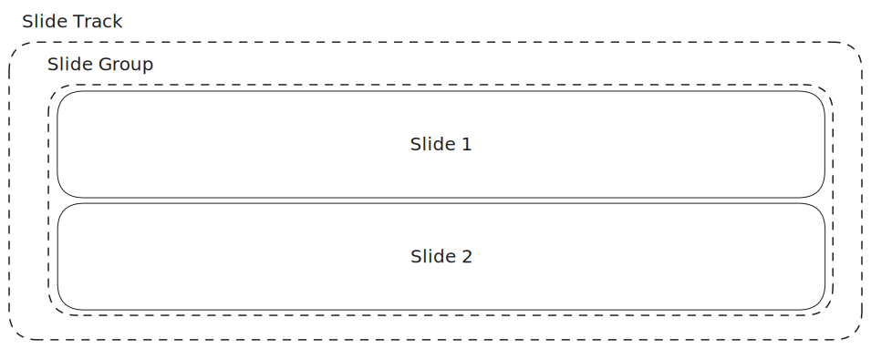
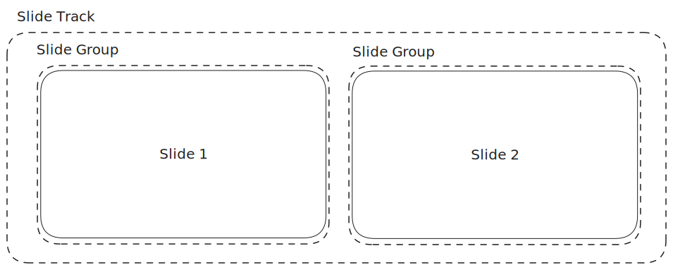
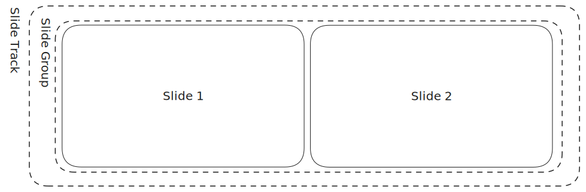
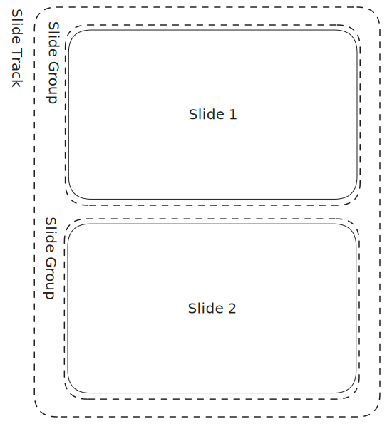

# Concept

## Component structure

The `VSlickCarousel` component consists of three major parts:

1. a **slide track** for displaying slides
2. **arrows** for navigation (_optional_)
3. **dots** for pagination & navigation (_optional_)

Inside the slide track, there are two major parts:

1. **slide groups** for grouping slides
2. **slides**

Here's a visualization of the entire component structure:



## Groups v.s. Slides

Understanding the distinction between **slide groups** and **slides** is crucial in knowing how the component works under different settings.

To do so, let's consider the basic usage where there is only one slide per group (`slidesPerGroup: 1`) and one group to show at a time (`groupsToShow: 1`):



Now, let's say we are in horizontal mode (`vertical: false`) and want to display two slides at a time. One might think that this could be done either by setting two slides per group (`slidesPerGroup: 2`) or by setting two groups to show at a time (`groupsToShow: 2`). While they would be right, the two options result in very different outcome:

### Two slides at a time

```js
{
    "slidesPerGroup": 2,
    "groupsToShow": 1,
    "vertical": false
}
```



### Two slide groups at a time

```js
{
    "slidesPerGroup": 1,
    "groupsToShow": 2,
    "vertical": false
}
```



## Groups span along the track; Slides stack up perpendicular to the track

The critical takeaway here is that **slide groups span along the track** whereas **slides stack up perpendicular to the track**. This is why in horizontal mode, when we set two slides per group, the result is two slides stacked on top of each other. Therefore, to show two slides span along the track, we need to set two groups to show at a time instead.

To hammer it in, let's examine the same examples again, but in vertical mode:

### Two slides at a time (vertical)

```js
{
    "slidesPerGroup": 2,
    "groupsToShow": 1,
    "vertical": true
}
```



### Two slide groups at a time (vertical)

```js
{
    "slidesPerGroup": 1,
    "groupsToShow": 2,
    "vertical": true
}
```



In vertical mode, the slide track is vertical. Therefore, when we set two slides per group, the result is two slides stacked on top of each other, i.e. from left to right. On the other hand, when we set two groups to show at a time, the result is two groups spanning the track, i.e. from top to bottom.
